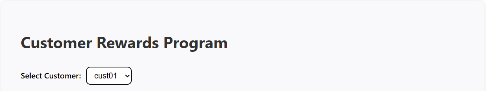
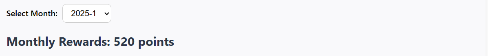
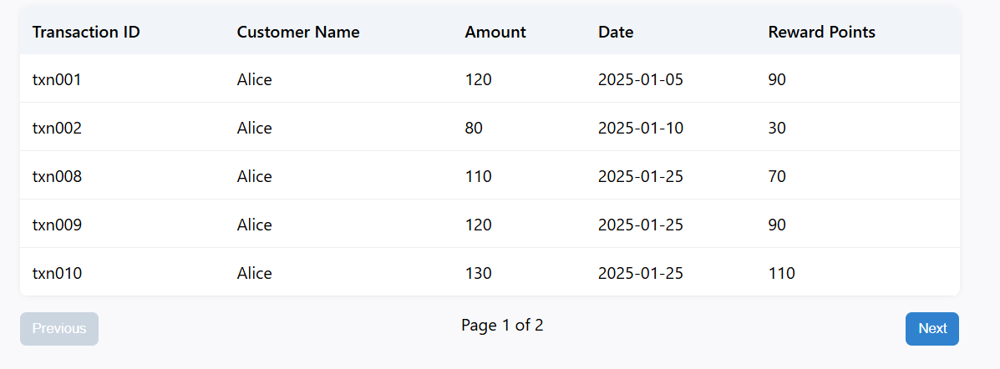
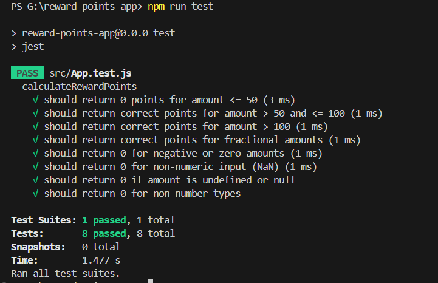

# Customer Rewards Program

This is a React application that calculates and displays reward points earned by customers based on their transaction history. The app simulates an API call, displays customer-wise and month-wise breakdowns of transactions and reward points, and implements pagination and filters.

---

## Features

- ✅ Fetches and displays transactions per customer
- ✅ Filters data by selected customer
- ✅ Month-wise breakdown of transactions
- ✅ Calculates reward points dynamically
- ✅ Paginated transaction table
- ✅ Styled using `styled-components`
- ✅ Error and loading state handling

---

###  Reward Calculation Logic

The points system works as follows:

- For every dollar spent over $100: 2 points
- For every dollar spent between $50–$100: 1 point
- Below $50: 0 points

Example:  
- $120 transaction → (20 × 2) + (50 × 1) = 90 points

The reward points are calculated using:

```js
export const calculateRewardPoints = (amount) => {
  if (typeof amount !== 'number' || amount <= 0 || isNaN(amount)) return 0;
  let points = 0;
  if (amount > 100) {
    points += (amount - 100) * 2 + 50;
  } else if (amount > 50) {
    points += (amount - 50) * 1;
  }
  return Math.floor(points);
};

```
---

####  Screenshots

📌 Home Page - Customer Selection

    

📌 Monthly Rewards Display

    

📌 Paginated Transaction Table

    

📌 Test Cases - Success Screenshot

    

---

#####  Installation

    1. Clone the repository
      
      https://github.com/DhwanilSolanky/reward-points-app.git
      cd reward-points-app

    2. Install dependencies

      npm install

    3. Run the app

      npm run dev

    4. Run tests

      npm run test

---

###### Tech Stack

- ⚛️ React (Vite)
- 💅 styled-components
- 🧪 Jest (Unit Testing)
- 📦 PropTypes (Type checking)
- 📁 Local JSON data for transactions
